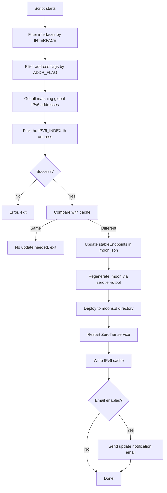

# update-zt-moon-dynamic-ipv6

Auto-update script for ZeroTier Moon node IPv6 addresses

## Overview

For ZeroTier Moon nodes using IPv6, if the public IPv6 address changes (e.g., ISP reassigns prefix, DHCPv6 lease expires), the Moon's `stableEndpoints` will become invalid, causing clients to lose connectivity.

This script periodically checks the current public IPv6 address, automatically updates the Moon configuration, and regenerates the `.moon` file to solve the IPv6 address drift issue.

## Features

- Automatically detects the specified global IPv6 address on the system
- Supports filtering by network interface (`INTERFACE`) and address flag (`ADDR_FLAG`)
- Compares against cached address, only updates when changes are detected
- Uses `jq` to modify `stableEndpoints` in moon.json
- Automatically regenerates `.moon` file and deploys it to `moons.d`
- Restarts ZeroTier service to apply configuration
- Optional email notification (via sendmail), **auto-detects and installs sendmail**
- Configurable IPv6 address index (for multi-IPv6 environments)
- **Supports `--uninstall` for one-click removal**

## Requirements

- OS: Debian / Ubuntu (with systemd)
- Dependencies: `jq`, `zerotier-idtool` (ZeroTier installed)
- Privilege: Requires root access

## Quick Start

### One-Click Install

```bash
curl -sSL https://raw.githubusercontent.com/sch-chun/update-zt-moon-dynamic-ipv6/main/install.sh | sudo bash
```

The install script will automatically:
1. Install dependencies (jq)
2. Deploy the main script to `/usr/local/bin/`
3. Interactively configure network interface, address flag, IPv6 index, and email notification
4. **Auto-detect sendmail, install if missing**
5. Set up a cron job (runs hourly)
6. Execute an immediate update

### One-Click Uninstall

```bash
curl -sSL -o /tmp/install.sh https://raw.githubusercontent.com/sch-chun/update-zt-moon-dynamic-ipv6/main/install.sh && sudo bash /tmp/install.sh --uninstall
```

Uninstall will clean up:
- Remove crontab job
- Delete main script `/usr/local/bin/update-zt-moon-ipv6.sh`
- Remove IPv6 address cache file

### Manual Installation

```bash
# 1. Deploy the script
sudo install -m 755 update-zt-moon-ipv6.sh /usr/local/bin/

# 2. Edit the script to configure
sudo vim /usr/local/bin/update-zt-moon-ipv6.sh
# Main variables to configure:
#   ZT_HOME - ZeroTier working directory (default: /var/lib/zerotier-one)
#   INTERFACE - Network interface name, leave empty for no restriction
#   ADDR_FLAG - IPv6 address flag filter, e.g., mngtmpaddr, leave empty for no restriction
#   IPV6_INDEX - Which global IPv6 address to use (default: 1)
#   ENABLE_EMAIL - Enable email notification
#   MAIL_TO - Notification recipient email address
#   MAIL_FROM - Sender email address

# 3. Set up cron job to check hourly
sudo crontab -e
# Add the following line:
# 0 * * * * /usr/local/bin/update-zt-moon-ipv6.sh

# 4. Run once manually
sudo /usr/local/bin/update-zt-moon-ipv6.sh
```

## Configuration

### Configurable Variables in the Script

| Variable | Default | Description |
|----------|---------|-------------|
| `ZT_HOME` | `/var/lib/zerotier-one` | ZeroTier working directory |
| `MOON_JSON` | `$ZT_HOME/moon.json` | Moon configuration file path |
| `MOONS_DIR` | `$ZT_HOME/moons.d` | Moon file deployment directory |
| `IPV6_CACHE` | `/var/cache/zt-moon-ipv6.txt` | IPv6 address cache file |
| `ZT_PORT` | `9993` | ZeroTier communication port |
| `INTERFACE` | `enp2s0` | Network interface name, leave empty for no restriction |
| `ADDR_FLAG` | `mngtmpaddr` | Matching IPv6 address flag (e.g., mngtmpaddr, dynamic, temporary), leave empty for no restriction |
| `IPV6_INDEX` | `1` | Which global IPv6 address to use (1-based) |
| `ENABLE_EMAIL` | `true` | Enable email notification |
| `MAIL_TO` | — | Email recipient address |
| `MAIL_FROM` | — | Sender email address |

> Tip: If your server has multiple IPv6 addresses, you can select a specific one by adjusting `IPV6_INDEX`. First run `ip -6 addr show scope global` to list available addresses and determine the index. If you need to restrict to a specific interface, set `INTERFACE`; if you only want to match addresses with a specific flag (e.g., `mngtmpaddr`), set `ADDR_FLAG`.

## Workflow



## Email Notification

The script can send notification emails via sendmail after an update. When enabled, each IPv6 address change triggers an email containing:

- Moon ID
- New IPv6 endpoint address
- Update timestamp
- Client re-orbit command hint

During one-click install, the script automatically checks whether `sendmail` is installed; if missing, it attempts to install it (sendmail or postfix). You can also install it beforehand:

```bash
# Debian / Ubuntu
sudo apt install -y sendmail

# CentOS / RHEL
sudo yum install -y sendmail
```

### Email Configuration Variables

| Variable | Config Time | Description |
|----------|-------------|-------------|
| `MAIL_TO` | Install prompt / manual edit | Notification recipient email |
| `MAIL_FROM` | Install prompt / manual edit | Sender email address, defaults to `root@current-hostname` |

Make sure the `MAIL_FROM` value is permitted by the MTA running sendmail, otherwise the email may be rejected.

## License

MIT
