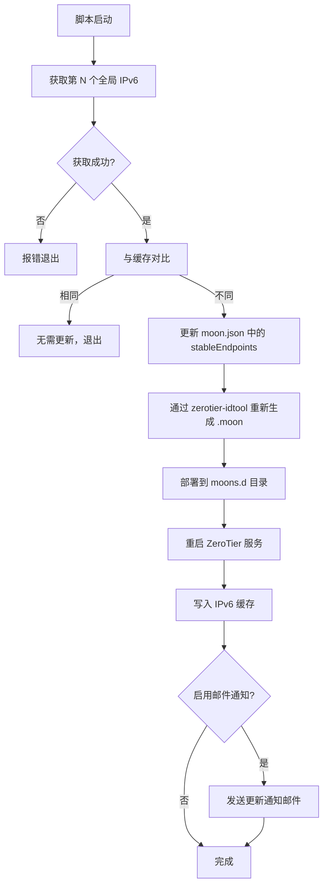

# update-zt-moon-dynamic-ipv6

ZeroTier Moon 节点的 IPv6 地址自动更新脚本

## 概述

对于使用 IPv6 的 ZeroTier Moon 节点，如果公网 IPv6 地址发生变更（例如 ISP 重新分配前缀、DHCPv6 租约到期），Moon 的 `stableEndpoints` 会失效，导致客户端无法连接。

本脚本通过定时检测当前公网 IPv6 地址，自动更新 Moon 配置并重新生成 `.moon` 文件，解决 IPv6 地址漂移问题。

## 功能特性

- 自动检测系统中指定的全局 IPv6 地址
- 与缓存地址比对，仅在变更时执行更新
- 使用 `jq` 修改 moon.json 中的 `stableEndpoints`
- 自动重新生成 `.moon` 文件并部署到 `moons.d`
- 重启 ZeroTier 服务使配置生效
- 可选邮件通知（通过 sendmail），**自动检测并安装 sendmail**
- 可配置 IPv6 地址索引（适用于多 IPv6 地址环境）
- **支持 `--uninstall` 一键卸载**

## 环境要求

- 操作系统：Debian / Ubuntu（含 systemd）
- 依赖：`jq`、`zerotier-idtool`（ZeroTier 已安装）
- 权限：需要 root 权限执行

## 快速开始

### 一键安装

```bash
curl -sSL https://raw.githubusercontent.com/sch-chun/update-zt-moon-dynamic-ipv6/main/install.sh | sudo bash
```

安装脚本会自动完成以下操作：
1. 安装依赖（jq）
2. 将主脚本部署到 `/usr/local/bin/`
3. 交互式配置 IPv6 地址索引和邮件通知（收发邮箱地址）
4. **自动检测 sendmail，缺失时自动安装**
5. 设置定时任务（每小时执行一次）
6. 立即执行一次更新

### 一键卸载

```bash
curl -sSL -o /tmp/install.sh https://raw.githubusercontent.com/sch-chun/update-zt-moon-dynamic-ipv6/main/install.sh && sudo bash /tmp/install.sh --uninstall
```

卸载会清理以下内容：
- 移除 crontab 定时任务
- 删除主脚本 `/usr/local/bin/update-zt-moon-ipv6.sh`
- 清理 IPv6 地址缓存文件

### 手动安装

```bash
# 1. 部署脚本
sudo install -m 755 update-zt-moon-ipv6.sh /usr/local/bin/

# 2. 编辑脚本，修改配置
sudo vim /usr/local/bin/update-zt-moon-ipv6.sh
# 主要修改以下变量：
#   ZT_HOME - ZeroTier 工作目录（默认为 /var/lib/zerotier-one）
#   IPV6_INDEX - 使用第几个全局 IPv6 地址（默认为 9）
#   ENABLE_EMAIL - 是否启用邮件通知
#   MAIL_TO - 接收通知的邮箱地址
#   MAIL_FROM - 发件邮箱地址

# 3. 设置定时任务，每小时检查一次
sudo crontab -e
# 添加以下行：
# 0 * * * * /usr/local/bin/update-zt-moon-ipv6.sh

# 4. 手动执行一次
sudo /usr/local/bin/update-zt-moon-ipv6.sh
```

## 配置说明

### 脚本开头的配置项

| 变量 | 默认值 | 说明 |
|------|--------|------|
| `ZT_HOME` | `/var/lib/zerotier-one` | ZeroTier 工作目录 |
| `MOON_JSON` | `$ZT_HOME/moon.json` | Moon 配置文件路径 |
| `MOONS_DIR` | `$ZT_HOME/moons.d` | Moon 文件部署目录 |
| `IPV6_CACHE` | `/var/cache/moon-ipv6.txt` | IPv6 地址缓存文件 |
| `ZT_PORT` | `9993` | ZeroTier 通信端口 |
| `IPV6_INDEX` | `9` | 使用第几个全局 IPv6 地址（从 1 开始） |
| `ENABLE_EMAIL` | `true` | 是否发送邮件通知 |
| `MAIL_TO` | — | 邮件接收地址 |
| `MAIL_FROM` | `root@hostname` | 发件邮箱地址 |

> 提示：如果你的服务器有多个 IPv6 地址，可以通过调整 `IPV6_INDEX` 选择特定的地址。先用 `ip -6 addr show scope global` 查看可用的地址列表，再确定索引值。

## 工作流程



## 邮件通知

脚本支持在更新完成后通过 sendmail 发送通知邮件。启用后，每次 IPv6 地址变更都会向指定邮箱发送包含以下信息的邮件：

- Moon ID
- 新的 IPv6 端点地址
- 更新时间
- 客户端重新 orbit 的命令提示

一键安装时会自动检测系统中是否存在 `sendmail` 命令，如果缺失则尝试自动安装（sendmail 或 postfix）。你也可以在安装前提前装好：

```bash
# Debian / Ubuntu
sudo apt install -y sendmail

# CentOS / RHEL
sudo yum install -y sendmail
```

### 邮件配置变量

| 变量 | 配置时机 | 说明 |
|------|----------|------|
| `MAIL_TO` | 安装交互 / 手动编辑 | 接收通知的目标邮箱 |
| `MAIL_FROM` | 安装交互 / 手动编辑 | 发件邮箱地址，默认为 `root@当前主机名` |

确保 `MAIL_FROM` 的值被 sendmail 所在的 MTA 允许发送，否则邮件可能被拒绝。

## 许可证

MIT
